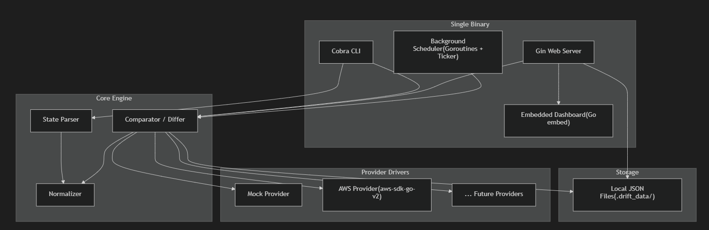

# Terraform Drift Detector

A cloud-agnostic, single-binary tool built in Go that continuously compares Terraform state files against actual cloud infrastructure to identify configuration drift — deleted resources, modified attributes, and tag changes — without requiring `terraform plan` or `apply`.

## Features

- **Drift Detection**: Compare `.tfstate` files against live cloud resources
- **Multiple Output Formats**: Colorized CLI output, JSON, and Web Dashboard
- **Extensible Providers**: Mock (built-in demo) and AWS support
- **Parallel Scanning**: Goroutines for fast, concurrent resource checking
- **Scheduled Scans**: Background scheduler for continuous monitoring
- **Beautiful Dashboard**: Premium dark-mode web UI with real-time stats
- **Single Binary**: Everything embedded — no dependencies to deploy

## Quick Start

### Build

```bash
go build -o drift.exe .
```

### Run a Scan (Mock Provider)

```bash
.\drift.exe scan --state testdata/mock.tfstate --provider mock
```

### JSON Output

```bash
.\drift.exe scan --state testdata/mock.tfstate --provider mock --json
```

### Launch Dashboard

```bash
.\drift.exe web --port 8080
```

Then open [http://localhost:8080](http://localhost:8080)

### Scheduled Scans

```bash
.\drift.exe schedule --state testdata/mock.tfstate --provider mock --interval 5m
```

## CLI Commands

| Command | Description |
|---------|-------------|
| `drift scan` | Run an ad-hoc drift scan |
| `drift web` | Launch the web dashboard |
| `drift schedule` | Start scheduled scans |

### Scan Flags

| Flag | Description | Default |
|------|-------------|---------|
| `--state, -s` | Path to `.tfstate` file | (required) |
| `--provider, -p` | Provider to use | `mock` |
| `--json, -j` | Output as JSON | `false` |

## Providers

### Mock Provider
Built-in provider for testing and demos. Uses naming conventions:
- Names containing `deleted` → simulates resource deletion
- Names containing `drifted` → simulates attribute/tag drift
- All others → returns matching state (in-sync)

### AWS Provider
Uses `aws-sdk-go-v2` with default credential chain. Supports:
- `aws_instance`
- `aws_s3_bucket`
- `aws_security_group`
- `aws_iam_role`

## Architecture



### Project Structure

```
drift.exe
├── cmd/          # Cobra CLI commands
├── internal/
│   ├── models/      # Data models
│   ├── parser/      # Terraform state parser
│   ├── comparator/  # Diff engine (parallel)
│   ├── provider/    # Cloud provider drivers
│   ├── scheduler/   # Background scan scheduler
│   └── store/       # JSON file storage
├── web/
│   ├── server.go    # Gin API server
│   └── static/      # Embedded dashboard
└── testdata/        # Sample state files
```

## Testing

```bash
go test ./... -v
```

## License

MIT
